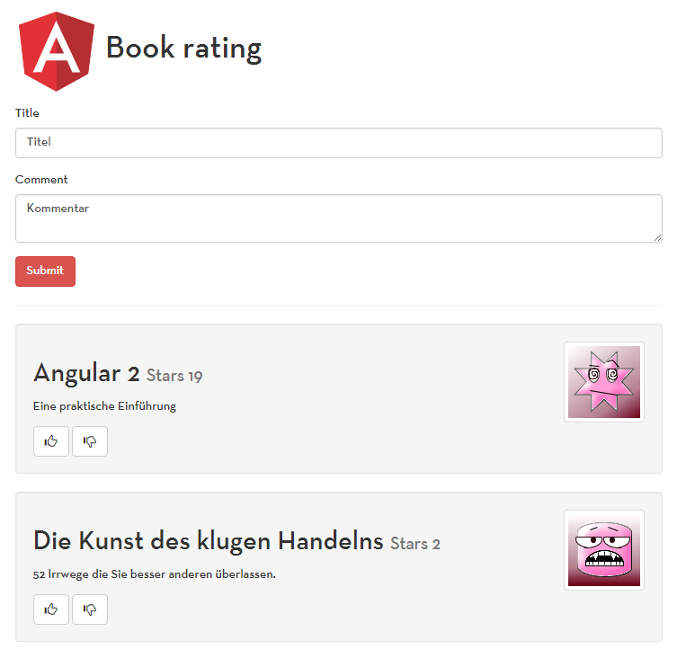
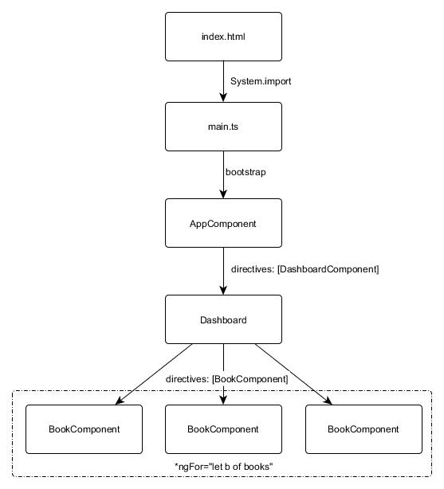

# Angular 2 Workshop

Ihre Trainer:  Gregor Woiwode und Johannes Hoppe

<hr>

## 1. Setup & Angular-CLI

Sie benötigen:

1. Visual Studio Code - https://code.visualstudio.com/
2. Node.js + NPM ab v4 - https://nodejs.org/

Folgende führen Sie bitte __gleich zu Beginn__ des Workshops aus:

```
npm install -g typings
npm install -g angular-cli@1.0.0-beta.6
```

````
ng -v
```

es muss folgende Version angezeigt werden: "1.0.0-beta.6"
Wenn dies NICHT der Fall ist, dann führen Sie bitte aus:

```
npm uninstall -g angular-cli
npm cache clean
npm install -g angular-cli@1.0.0-beta.6
```

Zum Abschluss bitte bereits im Arbeitsverzeichnis ausführen:

```
ng new book-rating
npm start
```

## 2. Angular-CLI Befehle

Für die Entwicklung benötigen Sie folgenden Kommandos:

Entwicklung  | Befehl
---       | ---
ng serve  | Webserver Starten & Builden
ng build  | Nur bauen
ng test   | Unit-Tests ausführen
Bugfix windows:<br>ng build && ng test --build=false | Unit-Tests ausführen
ng e2e    | Oberflächentests starten

Sie können die Angular-CLI verwenden, um diverse Bausteine generieren zu lassen:

Was Erzeugen  | Befehl
---       | ---
Component | `ng g component my-new-component`
Directive | `ng g directive my-new-directive`
Pipe      | `ng g pipe my-new-pipe`
Service   | `ng g service my-new-service`
Class     | `ng g class my-new-class`
Interface | `ng g interface my-new-interface`
Enum      | `ng g enum my-new-enum`


## 3. Die App



Wie entwickeln eine Anwendung um Bücher zu bewerten.
Die App wird schrittweise ausgebaut.
Die Anwendung besteht zum Anfang aus drei Komponenten:



<<<<<<< HEAD
## 4. Übungen

### 1. - Komponente erstellen

Lagern Sie das Formular zum erstellen eines Buchs in eine eigene Komponente `CreateBookForm` aus.
Stellen Sie sicher, dass diese Komponente das Ereignis `(book-created)` veröffentlicht, wenn ein Buch erstellt wurde.
Verarbeiten Sie das Ereignis in der `DashboardCompoent`, um das erstellte Buch der Liste hinzuzufügen. 

### 2. - Tests für das Model `Book` schreiben

Es wurde entschieden, dass der Wert eines Ratings nur zwischen `0` und `5` liegen darf.
Weisen sie mit einem Unit-Test nach, dass die fachliche Anforderung erfüllt ist.

```typescript
// /src/app/shared/book.spec.ts
describe('Rating a book', () => {
    it('should not be allowed to have a rating greater than 5', () => {
        // test
    });

     it('should not be possible have a rating smaller than 0', () => {
        // test
    });
});
```

## 3. - Validator schreiben

Um sicherzustellen, dass der Titel eines Buchs nur ein Mal vorkommt, soll ein Validator `CheckUniqueTitle` implementiert werden.
Wenn der Titel beriets existeirt, soll das Formular nicht versendet werden dürfen.
Außerdem, soll folgende Nachricht angezeigt werden: 'Der Titel dieses Buchs existiert bereits.'
=======


## Angular Template-Syntax

Wir werden in diesem Workshop nur die wichtigsten Bindungs verwenden.

Name               | Binding
------------------ | -------------------------------
Property-Binding   | [property]
Event-Binding      | (event)
Element-Referenzen | #idhandler
Bedingungen        | *ngIf="expression"
Schleifen          | *ngFor="expression"
Styling            | [class.nameOfClass]="expression" 
<<<<<<< HEAD
>>>>>>> handout: HTTP
=======


# Extra: HTTP

Um Zugriffe auf ein Backend realisieren zu köonnen, müssen asynchrone
Aufrufe auf die Serverschnittstelle (XMLHttpRequest) erfolgen.
Die Angular-Http-Klasse kapselt und vereinfacht das asynchrone Aufrufe per HTTP.

Den Teilnehmern steht folgende API zur Verfügung:
* http://book-monkey2-api.angular2buch.de/

Eine Beschreibung der Schnittstele gibt es hier:
* http://book-monkey2-api.angular2buch.de/swagger-ui/

## Daten Laden per GET

Dies ist ein Beispiel wie man `http` quick-and-dirty verwendet.
Im Laufe des Workshops werden wir den Code als Service auslagern und Observables verwenden.

```
// main.ts

import { HTTP_PROVIDERS } from '@angular/http';
bootstrap(AppComponent, [HTTP_PROVIDERS]);

```

```
import { Http, HTTP_PROVIDERS } from '@angular/http';
import { Book } from '../shared';

@Component({
})
export class MyComponent {

  books: Book[];
  book: Book;

  constructor(private http: Http) {}

  getAllBooks() {

    this.http
      .get('http://book-monkey2-api.angular2buch.de/books') // PLURAL S!
      .subscribe(response => {
        this.books = response.json();
      });
  }

  getSingleBook(isbn) {

    this.http
      .get(`http://book-monkey2-api.angular2buch.de/book/${isbn}`) // kein PLURAL S!
      .subscribe(response => {
        this.book = response.json();
      });
    });
  }
}

```
>>>>>>> handout: Daten Laden per GET
