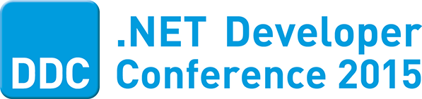
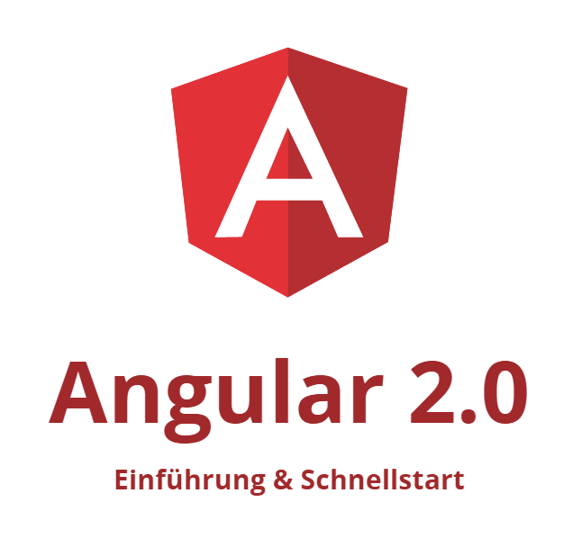
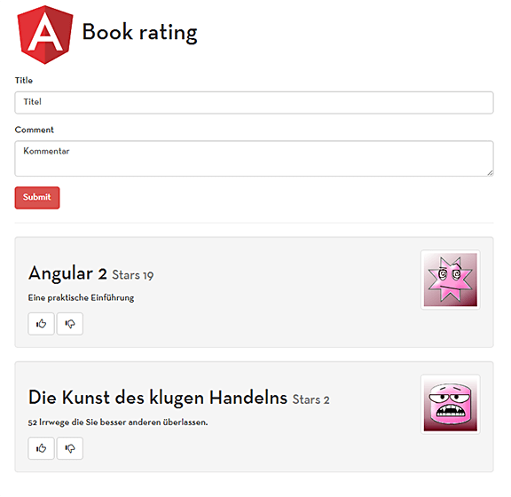

&nbsp;

Angular 2.0 wird in naher Zukunft fertig gestellt sein. Es gibt es bereits regelmäßige Vorabversionen für interessierte Entwickler. Das Angular-Team hat sich entschieden, alte Zöpfe rigoros abzuschneiden und ein komplett überarbeitetes Framework zu entwickeln. Die neue Version bricht mit bestehenden Konzepten - was für viel Aufregung gesorgt hat. Die Template-Syntax ist neu und man setzt nun Komponenten statt Controller ein. Auch der Einsatz von TypeScript rüttelt am einher gebrachten.

In diesem Workshop werden wir auf maßgebliche Änderung eingehen. Das vorliegende Handout ist ein Sammlung von (**unfertigen**) Fragmenten aus unseren Artikeln sowie unserem kommenden Buch zu Angular 2 beim dpunkt.verlag.

**Wir wünschen Viel Spaß beim Kennenlernen von Angular 2.0 Alpha-46!**

## Über die Trainer

<table><tr><td>
**Johannes Hoppe** ist selbstständiger IT-Berater, Softwareentwickler und Trainer. Er arbeitet derzeit als Architekt für ein Portal auf Basis von .NET und AngularJS. Er bloggt unter http://blog.johanneshoppe.de/ .</td>

<td>
**Gregor Woiwode** ist als Softwareentwickler im Bereich des Competitive Intelligence bzw. Enterprise Knowledge Managements für ein Softwareunternehmen in Leipzig tätig. Er veranstaltet Trainings AngularJS. Er bloggt unter http://www.woiwode.info/blog/ .</td></tr></table>

&nbsp;

&nbsp;

&nbsp;

&nbsp;

&nbsp;

## Inhalt
 
1. [Start mit Atom](01_start.md)
2. [Template Syntax](02_templating.md)
3. [Unit Tests](03_testing.md)

&nbsp;

## Quelltexte & Demos

* zu 1. https://github.com/Angular2Buch/angular2-module
* zu 2. https://github.com/Angular2Buch/template-syntax
* zu 3. https://github.com/Angular2Buch/angular2-testing

&nbsp;

## Folien zur "book-rating-app"

Während des Workshops entwickeln wir eine Anwendung mit Ihnen.
Zur Unterstützung sehen Sie Quelltext-Fragmente in einem Folienset.
Sie finden diese Folien unter:

https://github.com/Angular2Buch/presentations

