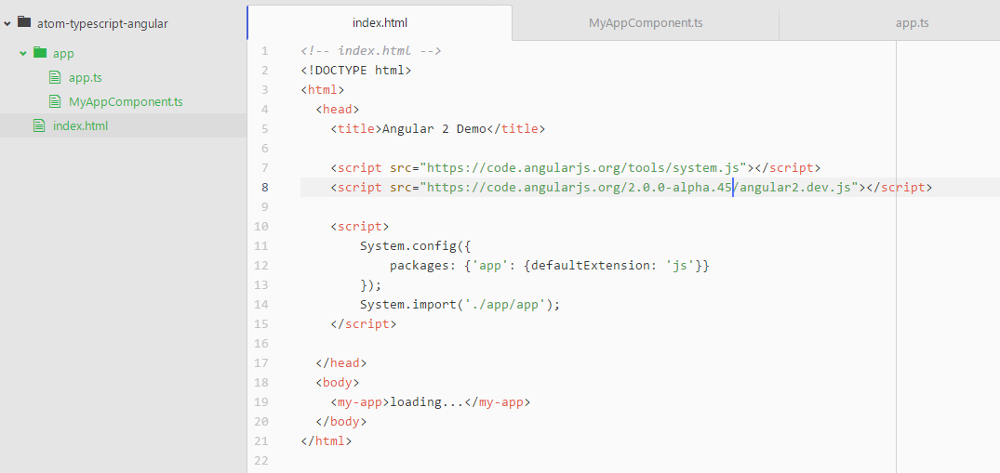
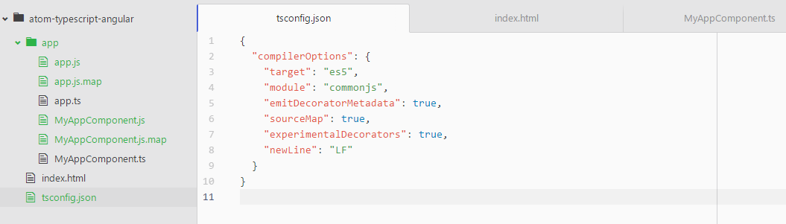
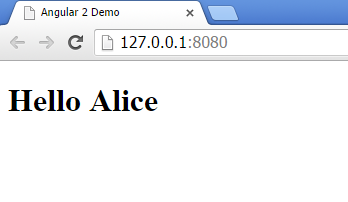
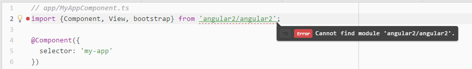
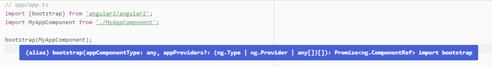

# Start: Angular 2.0 mit Atom nutzen


<a name="installieren"></a>
## 1. Atom und atom-typescript installieren

1. [Atom](https://atom.io/) installieren - Admin-Rechte sind übrigens nicht notwendig
2. [atom-typescript](https://atom.io/packages/atom-typescript) installieren - entweder über die grafische Oberfläche (Settings > Install) oder in der Shell per 
`apm install atom-typescript`


<a name="projekt"></a>
## 2. Projekt anlegen

Der Aufbau orientiert sich am Angular 2 Quickstart. Wir werden drei Dateien erstellen:

1. `index.html`
2. `src/app/app.ts` - für das Bootstrapping
3. `src/app/MyAppComponent.ts` - eine Komponente, um auch etwas anzuzeigen

Wichtig ist die Tatsache, dass man alle TypeScript-Dateien in einen Unterordner legt (hier `app/`). So kann man die korrekte Dateiendung einstellen. Da unsere TypeScript-Dateien (`*.ts`) zu JavaScript-Dateien (`*.js`) transpiliert werden, geben wir dies als `defaultExtension: 'js'` entsprechend an.

```html
<!-- index.html -->
<!DOCTYPE html>
<html>
  <head>
    <title>Angular 2 Demo</title>

    <script src="https://code.angularjs.org/tools/system.js"></script>
    <script src="https://code.angularjs.org/2.0.0-alpha.45/angular2.dev.js"></script>

    <script>
      System.config({
        packages: { app: { defaultExtension: 'js'}}
      });
      System.import('./app/app');
    </script>

  </head>
  <body>
    <my-app>loading...</my-app>
  </body>
</html>
```
> index.html

```javascript
// app/app.ts
import { bootstrap } from 'angular2/angular2';
import MyAppComponent from './MyAppComponent';

bootstrap(MyAppComponent);

```
> app/app.ts

```javascript
// app/MyAppComponent.ts
import { Component, View } from 'angular2/angular2';

@Component({
  selector: 'my-app'
})
@View({
  template: '<h1>Hello {{ name }}</h1>'
})
export default class MyAppComponent {
  name: string;

  constructor() {
    this.name = 'Alice';
  }
}
```
> app/MyAppComponent.ts





<a name="transpilieren"></a>
## 3. Transpilieren

Würden wir jetzt schon den Entwicklungsstand kontrollieren, so würden wie eine Fehlermeldung erhalten. Die ganze Logik liegt nämlich nur in Form von TypeScript-Dateien vor. Der Browser soll jedoch JavaScript-Dateien laden und ausführen.

Die Erzeugung jener Dateien holen wir nach, indem wir eine Datei Namens `tsconfig.json` in das Projektverzeichnis einfügen. Hierfür kann man `ctrl(bzw. cmd) + shift + p` drücken (Liste der Kommandos) und den Befehl `tsconfig` auswählen ("TypeScript: Create tsconfig.json Project File").

```javascript
{
  "compilerOptions": {
    "target": "es5",
    "module": "commonjs",
    "emitDecoratorMetadata": true,
    "sourceMap": true,
    "experimentalDecorators": true,
    "newLine": "LF"
  }
}
```
> tsconfig.json

Sobald die Konfigurations-Datei vorliegt, wandelt Atom alle TypeScript-Dateien beim Speichern automatisch um. 





Das Ergebnis lässt sich mit einem Webserver kontrollieren:

```cmd
npm install -g live-server
live-server

```



**Das war gar nicht schwer! :-)**


<a name="typings"></a>
## 4. Angular 2.0 Type Definitions

TypeScript wird die von uns erstellen TS-Dateien zwar transpilieren, jedoch erscheint ein Fehler, dass Angular nicht gefunden werden kann (`TS: Error: Cannot find module 'angular2/angular2'`). 



Ohne Typings kann der Compiler nicht die korrekte Verwendung der Angular-Types prüfen. Ebenso steht keine automatische Vervollständigung zu Verfügung. Die notwendigen [Type Definitions von DefinitelyTyped](https://github.com/borisyankov/DefinitelyTyped/tree/master/angular2) sind leider derzeit nicht aktuell. Die beste Quelle von Angular 2.0 Type Definitions ist derzeit das NPM Paket. Wenn man schon mal dabei ist, kann man auch gleich noch SystemJS auf die Platte laden. 

```cmd
npm install angular2@2.0.0-alpha.46 systemjs@0.19.5
```

Ein wenig Bauchschmerzen macht mir übrigens die direkte Verwendung des `node_modules` Ordners. Es ist eine ewige Streitfrage, ob man diesen Ordner unter Versionsverwaltung stellt oder nicht. Den Ordner nun auch noch im Webserver verfügbar zu machen, ist eine neue Qualität. Ich bin damit noch nicht wirklich glücklich - aber das ist ein anderes Thema.

Man kann nun eine lokale Kopie der beiden Frameworks verwenden. Bei dieser Gelegenheit lassen wir auch die Einstellung für die `defaultExtension: 'js'` weg, da diese für ein definiertes Paket sowieso die Standardeinstellung ist (siehe [#759](https://github.com/systemjs/systemjs/issues/759)).

```html
<!-- index_local.html -->
<!DOCTYPE html>
<html>
  <head>
    <title>Angular 2 Demo</title>

    <script src="../node_modules/systemjs/dist/system.js"></script>
    <script src="../node_modules/angular2/bundles/angular2.dev.js"></script>

    <script>
      System.config({ packages: { app: {}}});
      System.import('./app/app');
    </script>

  </head>
  <body>
    <my-app>loading...</my-app>
  </body>
</html>
```
> index_local.html

Weiterhin kann man nun TypeScript die korrekten Pfade aufzeigen. Eine geniale Erfindung ist die [`filesGlob`](https://github.com/TypeStrong/atom-typescript/blob/master/docs/tsconfig.md#filesglob)-Einstellung, welches man mit dem Snippet `fg` in die `tsconfig.json` einfügt:

```javascript
{
  "compilerOptions": {
    "target": "es5",
    "module": "commonjs",
    "emitDecoratorMetadata": true,
    "sourceMap": true,
    "experimentalDecorators": true,
    "newLine": "LF"
  },
  "filesGlob": [
    "./**/*.ts",
    "../node_modules/angular2/angular2.d.ts",
    "../node_modules/angular2/bundles/typings/**"
  ],
  "files": [
     "-- wird automatisch gefüllt! --"
  ]
}
```

Das manuelle Bekanntmachen von Dateien über das `files`-Property oder über inline-Kommentare in den TS-Dateien (z.B. `/// <reference path="../node_modules/angular2/bundles/typings/angular2/angular2.d.ts"/>`) ist damit Geschichte! Atom hält die Liste der Dateien automatisch aktuell. Nun werden auch sofort die Typings von Angular 2.0 gefunden. Nun stehen Hilfen wie "Type information on hover", "Autocomplete", "Goto Declaration" und eine [Reihe weiterer Features](https://github.com/TypeStrong/atom-typescript#features) zur Verfügung.


> Type information on hover


