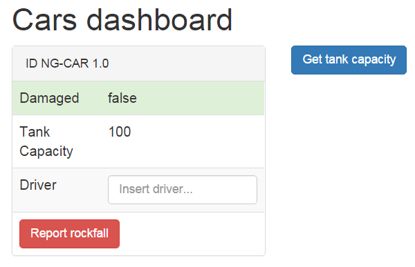
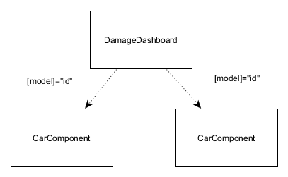
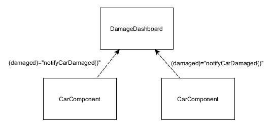
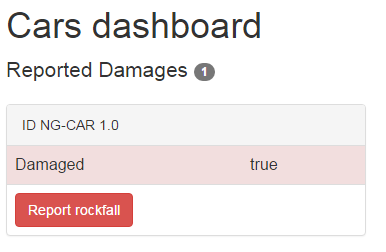
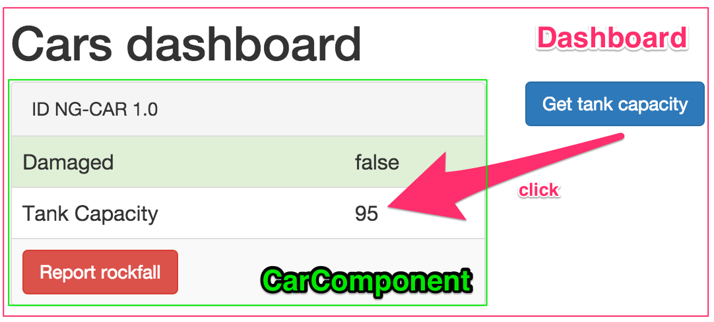

# Angular Template-Syntax

Dependecy Injection gute Testbarkeit waren schon immer ein Alleinstellungsmerkmal für AngularJS. Mit der neuen Version wurden viele Details verbessert. Es wird Zeit tiefer in das Framework einzutauchen. Dieser Artikel stellt die neue Template-Syntax von Angular 2.0 vor. Es halten zahlreiche, neue Möglichkeiten Einzug, um Oberflächenelemente zu beschreiben. Die Entwickler von Angular verfolgen hierbei ein großes Ziel: Das Konzept der Template-Syntax eindeutiger und nachvollziehbarer zu formulieren, als es bei der Vorgängerversion der Fall ist. 

Zur näheren Erläuterung wird ein Prototyp genutzt, der als Dashboard für Schäden an Autos dienen soll.



Neben einer ID und dem Schadensstatus kann auch der aktuelle Füllstand des Fahrzeugs abgefragt werden. Des Weiteren kann mit einem Klick ein Steinschlag (engl: "rockfall") gemeldet werden.

> **Übrigens** Sie finden das hier vorgestellten Beispiel auf GitHub unter: https://github.com/Angular2Buch/template-syntax

## Components & Views

Angular 2 Anwendungen bestehen aus verschiedenen Komponenten (Components), die miteinander agieren können. Für das Dashboard wird eine Komponente benötigt. Im Dashboard wird eine Liste von Autos abgebildet werden. Das bedeutet, dass hierfür eine weitere Komponente implementiert wird.

Eine Angular 2.0 Komponente ist wie folgt aufgebaut.

```javascript
// dashboard.component.ts
import { Component, View } from 'angular2/angular2';

@Component({ selector: 'dashboard' })
@View({
    template: `<p>{{ id }}</p>`
})
export default class DashboardComponent {
    id: string = 'NG-Car 2015';
}
```

Von Angular werden zunächst zwei Module `@Component()` und `@View()` importiert. Diese beiden Module sind im Speziellen TypeScript-Dekoratoren. Dekoratoren ermöglichen es Klassen zu
durch Meta-Angaben erweitern. `@Component()` spezifiziert, dass die Dashboard-Komponente über den `selector` &lt;dashboard&gt; im DOM des HTML-Dokuments eingesetzt wird.
Mit @View() definiert man das Template, das mit der Komponenten verknüpft ist. In diesem Beispiel wird das Feld `id`, aus der Klasse `DashboardComponent`, im Template gebunden und angezeigt. An dieser Stelle wird deutlich, was eine Komponente ist: Komponenten sind die neuen zentralen Bausteine von Angular 2.0. Sie übernehmen die Rolle von Direktiven und Controllern aus AngularJS.

> Eine Komponente ist ein angereichertes Template, das im Browser zur Anzeige gebracht wird. Das Template verfügt über ein spezifisches Verhalten, das in Angular 2.0 durch TypeScript-Dekoratoren beschrieben wird.

## Interpolation

Wie wird nun aus dem Ausdruck `{{ id }}` ein angezeigter Text im Browser?
Bereits in AngularJS 1.x konnten Daten mithilfe zweier geschweifter Klammern an ein HTML Template gebunden werden. Der Wert wurde mittels Interpolation ausgewertet und angezeigt.
Dieses Konzept bleibt in Angular 2.0 erhalten.

```html
<p>{{ id }}</p>
```

Diese Schreibweise ist eine Vereinfachung der tatsächlichen Syntax. Denn bevor dieses Template im Browser ausgegeben wird, setzt Angular diesen Ausdruck in ein Property-Binding um. [[6]]

```html
<p [text-content]="interpolate(['Gregor'], [name])"></p>
```

## Komponenten miteinander verknüpfen

Um in dem Dashboard nun ein Auto abbilden zu können wird eine weitere Komponente benötigt.

```javascript
// car.component.ts
import { Component, View, Input } from 'angular2/angular2';

@Component({ selector: 'car' })
@View({
    template: `<p>{{ id }}</p>`
})
export default class CarComponent {
    @Input() id: string;
}
```

Im ersten Schritt soll diese Komponente lediglich die zugewiesene Identifikationsnummer ausgeben. Die @Input()-Dekorator bietet die Möglichkeit, Werte an die `CarComponent` zu übergeben. Näheres wird im folgenden Abschnitt erläutert.

Nun kann die CarComponent im Dashboard referenziert und im Template verwendet werden.

```javascript
// dashboard.component.ts
import { Component, View } from 'angular2/angular2';
import { CarComponent } from '../car/car.component';

@Component({ selector: 'dashboard' })
@View({
    directives: [CarComponent],
    template: `<car [id]="id"></car>`
})
export default class DashboardComponent {
    id: string = 'NG-Car 2015';
}
```

Im Wesentlichen wurden drei Anpassungen vorgenommen.

1. Über ein weiteres import statement wird `CarComponent` geladen.
2. @View() wird durch die Eigenschaft `directives` ergänzt, damit `CarCompoennt` im Template verwendet werden kann.
3. Das Feld `id` wird and die gleichnamige Eigenschaft der `CarComponent` gebunden (Hierbei handelt es sich um ein Porperty-Binding).

So wurde über die Datenbindung die erste Interaktion zwischen zwei Komponenten realisiert.

## Input- und Output-Properties

Input- und Output-Properties sind Eigenschaften die die API einer Angular-Komponente beschreiben. Über Inputs werden Informationen an eine Komponente übergeben. Mit Outputs kommuniziert die Komponente Änderungen nach außen.
Inputs werden durch `Property-Bindings` beschrieben. Outputs können über `Event-Bindings` abonniert werden.

### Property-Bindings

Mit Properties werden einer Komponente Daten übermittelt.



Property-Bindgins zeichnen sich durch eckicke Klammern aus (`[id]`)

```html
// dashboard.component.ts
<car [id]="id"></car>
```

Anstatt eckiger Klammern können Property-Bindings auch mit der vollständigen Syntax `bind-{property-name}="{expression}"` beschrieben werden.

```html
// dashboard.component.ts
<car bind-id="id"></car>
```

### Event-Bindings

Events bieten die Möglichkeit auf Veränderungen einer Komponente zu reagieren. Sie bieten einer Komponente die Möglichkeit mit ihrer Außenwelt zu kommunizieren.



Event-Bindings zeichnen sich durch runde Klammern aus (`(damaged)`). Sie triggern die Ausführung eines Statements.

```html
<car (damaged)="report(damage)"></car>
```

Auch für diese Syntax existiert eine längere Syntax in der Form `on-{event-name}="{statement}"`:

```html
<car on-damaged="report(damage)"></car>
```

Um solch ein Event aus einer Komponente heraus zu erzeugen, wird der Dekorator `@Output()` verwendet. Das dazugehörige Property ist ein `EventEmitter`, der Ereignisse auslösen kann.

```javascript
// car.component.ts
import { EventEmitter } from 'angular2/angular2';

@Component({ /* ... */ })
class CarComponent() {
  @Input() id:string;
  @Output() damaged:EventEmitter = new EventEmitter();

  reportDamage() {
    // Event auslösen
    this.damaged.next(this.id);
  }
}
```

Neben der Verwendung runder Klammern, können Event-Bindings auch mit dem Ausdruck `on-{Event-Name}="{callback()}"` deklariert werden.

```html
// dashboard.component.ts
<car on-damaged="report(damage)"></car>
```

In der Dashboard Komponente muss lediglich eine Methode ergänzt werden, die nach dem Ausläsen des Events `(damaged)`, ausgeführt wird.

```javascript
// dashboard.component.ts
export default class DashboardComponent {
    /* ... */
    notifyCarDamaged() {
        this.totalDamages++;
    }
}
```

In diesem Fall wird im Dashboard die Anzahl der gemeldeten Schadensfälle zusammengezählt.



### Two-Way Bindings mit `ng-model`

> **ACHTUNG** Um die Direktive `[(ng-model)]` zu verwenden, muss vorher das Modul { FORM_DIRECTIVES } importiert werden.

Aus Sicht einer Komponente werden mit Property-Bindings schreibende und den Event-Bindings lesende Operationen spezifiziert. Wie in AngularJS 1.x, ist es auch möglich Zwei-Wege-Bindungen (Two-Way-Bindings) zu realisieren. In der Template-Syntax von Angular 2.0 werden hierfür die Schreibweisen beider Binding-Arten kombiniert.

```html
<input [(id)]="id">
```

Die eckigen Klammern legen fest, dass ein gegebener Wert an das &lt;input&gt;-Element gebunden wird. Die runden Klammern machen deutlich, dass Änderungen der Eigenschaft überwacht werden und diese mithilfe der Direktive `ng-model` in die Eigenschaft zurückschreiben werden.

Wie in den vorangehenden Beispielen gibt es auch hier eine alternative Schreibweise.

```html
<input bindon-ng-model="id">
```

Die Zwei-Wege-Bindung lässt sich auch ohne `ng-model` realisieren. Das Markup wird so allerdings etwas komplexer.

```html
<input
  [value]="id"
  (input)="id=$event.target.value">
```

Hierbei gibt `$event` Zugriff auf das auslösende Ereignis. Es ist ein natives Javascript-Event. Daher kann dessen API verwendete werden, um auf das betroffene Element zuzugreifen und dessen werden auszulesen (`id=$event.target.value`).

## Template Referenzen

Innerhalb eines Templates können Referenzen auf HTML-Elemente, Komponenten und Datenbindungen erzeugt werden, um mit ihnen zu arbeiten.

```html
<input #id type="text"/>
{{ id.value }}
```

> Das Binding {{ id.value }} macht deutlich, dass die lokale Referenz das HTML-Element referenziert und nicht nur dessen Wert.

Anstatt der # können lokale Refrenzen auch mit dem Prefix `var-` deklariert werden.

```html
<input var-id type="text"/>
{{ id }}
```

Lokale Referenzen auf Komponenten unterscheiden syntaktisch nicht im Vergleich zu den HTML-ELementen. Zusätzlich können die Methoden der Komponente genutzt werden, um so mit ihr zu interagieren.

```html
<car #car></car>
<button (click)="car.getTankCapacity()">Get tank capacity</button>
```

In diesem Fall wird bei einem Click-Event die Methode `getTankCapicity` ausgeführt.
In dieser Demo reduziert sich der Tankinhalt des Fahrzeug jedes Mal im 5%, wenn dieser angefragt wird.

```javascript
// car.component.ts
export default class CarCmp {
  /* ... */
  getTankCapicity() {
    this.model.tankCapacity -= 5;
  }
}
```



Lokale Referenzen können auch auf Objekte zeigen. Im folgenden Beispiel wird der Platzhalte `#c` genutzt, um für jedes Element einer Liste `cars` die Komponente `Car`zu rendern (Hier lohnt sich ein Blick, in das erwähnte GitHub Code-Repository).

```html
<car *ng-for="#c in cars" [model]="c">
```

> Bei dem Stern (`*`) vor der ng-for Direktive handelt es sich um eine Kurzschreibweise. Näheres erfahren Sie im nächsten Abschnitt.

## * und &lt;template&gt;

Direktiven wie `ng-for`,`ng-if` und `ng-switch` werden zusammen mit einem Stern (`*`) verwendet. Diese Direktiven werden strukturelle Direktiven (Structural Directives) genannt, da sie DOM-Elemente hinzufügen oder entfernen.

```html
<div *ng-if="totalDamages > 0">{{ totalDamages }}</div>
```

In diesem Beispiel wird die Anzahl aller gemeldeten Schäden nur dann im Dashboard angezeigt, wenn derenz Anzahl größer 0 ist.
Bei dem `*` handelt es sich, um eine Kurzschreibweise, die das Schreiben des Templates vereinfachen soll.
Sie wird als _Micro Syntax_ bezeichnet, da Angular 2.0 diesen Ausdruck interpretiert und wieder in die uns bekannten Bindings umsetzt.
Beispielsweise ist auch folgende Verwendung der ng-if Direktive zulässig.

```html
<template [ng-if]="totalDamages > 0">
  <div>{{ totalDamages }}</div>
</template>
```

Angular übersetzt die Micro Syntax in ein Property-Binding und umschließt das Template mit einem &lt;template&gt;-Tag. Dadurch entfällt der `*` , vor dem `ng-if`.[[5]]

## Der Pipe-Operator `|`

Pipes korrespondieren zu `filters` aus AngularJS 1.x und werden genutzt, um Daten zu für die Anzeige zu transformieren. Sie nehmen Eingabeargumente entgegen und liefern das transformierte Ergebnis zurück.
In einem Binding-Ausdruck werden sie durch das Symbol `|` (genannt Pipe) eingeleitet.

```html
/* Der Wert von name wird in Großbuchstaben ausgegeben */
<p>{{ id | uppercase}}</p>
```

Pipes können auch aneinander gehangen werden, um mehrere Transformationen durchzuführen.

```html
<p>{{ id | uppercase | lowercase}}</p>
```

## Der Elvis-Operator `?`

Die Bezeichnung "Elvis Operator" ist eine Ode an den Mythos, der sich damit befasst, ob Elvis tatsächlich tot ist oder nicht.

Der `?`-Operator ist ein nützliches Instrument, um zu prüfen, ob ein Wert `null` oder `undefined` ist. So können Fehlermeldungen bei der Template-Erzeugung vermieden werden.

```html
<p>{{ car?.driver }}</p>
```

Hier wird geprüft, ob das Objekt `car` existiert. Wenn ja, wird der Namen des Fahrers ausgegeben. Der `?`-Operator funktioniert ebenfalls in komplexeren Objektbäumen.

```html
<p>{{ car?.driver?.licences?.B1 }}</p>
```

## W3C-Konformität

Auch wenn sich die Syntax zu Beginn ungewohnt ist, handelt es sich hierbei um valides HTML. [[6], [8]] In der HTML Spezifikation des W3C heist es:

> Attribute names must consist of one or more characters other than the space characters, U+0000 NULL, """, "'", ">", "/", "=", the control characters, and any characters that are not defined by Unicode.

## Vollständiges Beispiel

```javascript
import { Component, View , Input, Output } from 'angular2/angular2';
import { EventEmitter, FORM_DIRECTIVES }   from 'angular2/angular2';

@Component({ selector: 'car' })
@View({
  directives:[FORM_DIRECTIVES],
  template: `
  <p>ID {{ id | uppercase }}</p>
  <p>{{ tankCapacity }}</p>
  <input [(ng-model)]="id"
         placeholder="Change ID ...">
  <button (click)="rockfall()">Report rockfall</button>
  `
})
export default class CarComponent {
  @Input() id: string;
  @Input() tankCapacity: number;
  @Output() damaged: EventEmitter = new EventEmitter();

  rockfall() {
    this.damaged.next(this.id);
  }

  getTankCapacity() {
    this.tankCapacity = Math.floor(Math.random() * 100);
  }
}
```
[car.component.ts]

```javascript
import { Component, View, NgIf } from 'angular2/angular2';
import CarComponent from '../car/car.component';

@Component({ selector: 'dashboard' })
@View({
  directives: [CarComponent, NgIf],
  template: `
    <p *ng-if="totalDamages > 0" class="lead">Reported Damages:{{ totalDamages }}</p>
    <car #car
         [id]="id" [tank-capacity]="tankCapacity"
         (damaged)="notifyCarDamaged()"></car>
    <button (click)="car.getTankCapacity()">Get tank capacity</button>
  `
})
export default class DashboardComponent {
  id: string;
  tankCapacity: number;
  totalDamages: number;

  constructor() {
    this.id = 'ng-car 1.0';
    this.tankCapacity = 100;
    this.totalDamages = 0;
  }

  notifyCarDamaged() {
    this.totalDamages++;
  }
}
```
[dashboard.component.ts]

```javascript
import {bootstrap} from 'angular2/angular2';
import Dashboard   from './components/dashboard/dashboard.component';

bootstrap(Dashboard);
```
[app.ts]

```html
<html>
  <head>
    <title>Demo | Template-Syntax</title>
    <script src="https://code.angularjs.org/tools/system.js"></script>
    <script src="https://code.angularjs.org/2.0.0-alpha.45/angular2.dev.js"></script>
    <script>
      System.config({ packages: { app: { defaultExtension: 'js'}}});
      System.import('./app/app');
    </script>
  </head>
  <body>
    <dashboard>loading...</dashboard>
  </body>
</html>
```
[index.html]

# Zusammengefasst

- Input- und Output-Properties beschreiben die API einer Komponente
- Über Inputs "fließen" Daten in die Komponente hinein.
- Inputs werden über Property-Bindings aktualisiert ([property])
- Über Outputs "fließen" Daten aus der Komponente heraus.
- Outputs werden mithilfe von Event-Bindings abonniert ((event)).
- Ein Property-Binding und Event-Binding können kombiniert werden, um ein Two-Way-Binding zu beschreiben ([(twoWay)]). [[2]]

# Polymer Webkomponenten nutzen

In AngularJS 1.x ist Entwicklungsaufwand nötig, um Webkomponenten anderen Bibliotheken integrieren zu können. Es müssen Direktiven geschrieben werden, um Angular die Statusänderungen der "Fremdkomponenten" mitzuteilen. [[9]]

Mit Angular 2.0 ist diese Arbeit nicht mehr nötig. Es wird nicht mehr unterschieden, ob es sich um ein natives Browserelement oder eine Web Component handelt. Angular hat nur Kenntnis davon, dass es an bestimmten Stellen im DOM Elemente instanzieren muss und es Eigenschaften schreiben, sowie Event-Listener erzeigen soll.

Das ermöglicht Beispielsweise die direkte Verwendung der Komponente `google-youtube` aus dem Polymer-Projekt. [[10]]

```html
<google-youtube
  #player
  [video-id]="videoId">
</google-youtube>
<button (click)="player.play()"></button>
<button (click)="player.pause()"></button>
```

```javascript
@View({ /* … */})
export default class DashboardComponent {
  /* ... */
  videoId: string;

  constructor() {
    /* ... */
    this.videoId = "ewxEFdMPMF0";
  }
```
Alle im Artikel beschriebenen Konzepte können hier nahtlos verwendet werden. Anhand der Online Dokumentation von `google-youtube` ist bekannt welche Eigenschaften und Aktionen zur Verfügung stehen [[10]]. Das Elementattribut `video-id` kann über ein Property-Binding gesetzt werden (`[video-id]`). Wird der Komponente eine gültige Id eines Videos von Youtube übergeben initialisiert sich der Video-Player selbstständig und kann verwendet werden.
Unter Verwendung der Referenz `#player` können die Aktionen der Webkomponente von anderen Webelementen gesteuert .

Angular stellt über die Template-Syntax eine einheitliche API zur Verfügung die auf jeder Web Component angewendet werden kann.


# Fazit

In Angular 2.0 wird die Template-Syntax in mehrere Konzepte aufgebrochen. Der Datenfluss zwischen Komponenten wird dadurch konkret definiert. Daher ist es mit einem Blick auf ein Template möglich, zu erkennen, wie sich eine Komponente verhält. Somit können, im Gegensatz zur Vorgängerversion AngularJS, Templates in Angular 2.0 diffiziler und genauer beschrieben werden.
Allerdings sind auch mehrere Möglichkeiten vorhanden Templates und Bindings zu definieren. Daher ist es ratsam, sich im Team auf jeweils eine der angebotenen Schreibweisen zu einigen, um ein vertrautes und homogenes Bild im Markup zu schaffen.


[1]: https://angular.io/docs/ts/latest/quickstart.html "5 Min Quickstart"
[2]: http://victorsavkin.com/post/119943127151/angular-2-template-syntax "Angular 2 Template Syntax"
[3]: https://www.youtube.com/watch?v=-dMBcqwvYA0 "ng-conf 2015 Keynote 2"
[4]: ng-book "2 - The Complete Book on AngularJS 2 by Ari Lerner, Felipe Coury, Nate Murray, Carlos Taborda"
[5]: https://angular.io/docs/ts/latest/guide/template-syntax.html "angular.io - Template-Syntax"
[6]: http://blog.thoughtram.io/angular/2015/08/11/angular-2-template-syntax-demystified-part-1.html "Template-Syntax demystified"
[7]: https://youtu.be/bVI5gGTEQ_U "Angular 2 Data Flow – Jeff Cross, Rob Wormald and Alex Rickabaugh"
[8]: http://www.w3.org/TR/html-markup/syntax.html "W3C - HTML: The Markup Language (an HTML language reference)"
[9]: https://amitgharat.wordpress.com/2013/02/03/an-approach-to-use-jquery-plugins-with-angularjs/ "jQuery Plugins mit AngularJS verwenden"
[10]: https://elements.polymer-project.org/elements/google-youtube "google-youtube Web Component"
