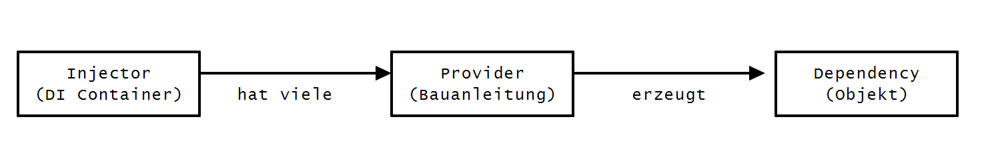

# Dependecy Injection und Unit-Testing mit Angular 2.0

Dependecy Injection gute Testbarkeit waren schon immer ein Alleinstellungsmerkmal für AngularJS. Mit der neuen Version wurden viele Details verbessert. Es wird Zeit, der Anwendung neue Funktionen zu geben, professionelle Entwurfsmuster anzuwenden und Fehlerfreiheit des Codes mit Unit-Tests zu beweisen!


## Inversion of Control

Das Dashboard war die Demo-Anwendung aus der letzten Ausgabe. Im Dashboard soll man nun Informationen zum aktuell günstigsten Benzinpreis erhalten. 


> Screenshot: Mit dem günstigsten Benzinpreis die Autos betanken

Wenn man an einer beliegen Stelle im Programmcode eine andere Funktionalität benötigt, dann liegt es zunächst nahe, jene andere Funktionalität an Ort und Stelle zu initialisieren. Ein erster Ansatz könnte wie folgt ausschauen:

```javascript
var Dashboard = function() {
  this.gasService = new GasService();
  
  // gasService verwenden
  this.gasService.getBestPrice();
}
```


Dieses Vorgehen ist prinzipiell einwandfrei - nur stößt man mit zunehmender Menge an Code an eine Grenze. Der Code wird zunehmend unübersichtlicher, schwerer zu Warten und verweigert sich einem einfachen Test-Setup. Das Problem lässt sich dadurch begegnen, dass man die Verantwortung zum Erzeugen von Abhängigkeiten an eine übergeordnete Stelle abgibt. 

Dies ist die Idee hinter dem Prinzip des **"Inversion of Control"**. Bei diesem Prinzip kehrt man die Verantwortlichkeit einfach um. Das Prinzip findet sich in verschiedenen Entwurfsmustern in allen Programmiersprachen wieder. AngularJS zum Beispiel verwendet das Entwurfsmuster **"Dependency Injection"**. Ein Framework im Kern von AngularJS sorgt dafür, das die benötigte Abhängigkeit identifiziert wird und der Konstruktor-Funktion beim Aufruf bereit gestellt wird. In AngularJS 1.x kann man einen Service wie folgt anfordern:

```javascript
// AngularJS 1.x 
var Dashboard = ['GasService', function(GasService) {
  this.gasService = GasService;
}]
```

Wer das DI-Framework aus AngularJs 1.x kennt, der wird mit Sicherheit auch an dessen Grenzen gestoßen sein. Besonders hinderlich sind fehlende Namespaces und die Notwendigkeit, stets alle Abhängigkeiten per Name zu identifizieren. Dies ist doppelter Schreibaufwand. Im vorliegenden Beispiel muss man zum Beispiel zwei mal "GasService" schreiben.

## Dependency Injection in Angular 2.0



> Die wichtigsten Bausteine für DI in Angular 2.0


 Mit der Unterstützung von ECMAScript 6 bzw. von TypeScript wird die Bedienung nun viel vertrauter. So lässt sich mittels des Decorators `@Inject` die Abhängigkeit in den Konstruktor injizieren:

```javascript
class GasService {
}

class Dashboard {
  constructor(@Inject(GasService) gasService) {
    console.log('Dependency:', gasService)
  }
}

var injector = Injector.resolveAndCreate([Dashboard, GasService]);
var dashboard = injector.get(Dashboard);
```
> Listing 1: Constructor Injection mit ES6

Die Methode `resolveAndCreate()` erzeugt einen einsatzbereiten Injector. Die Methode akzeptiert ein Array aus Typen oder Providern. Wird nur ein Typ übergeben, so wird ein entsprechender Provider für diesen Typ erzeugt (`useClass` - wird später erläutert). Sofern man TypeScript einsetzt, kann man die Schreibweise noch etwas mehr vereinfachen. Durch die Verwendung von Typen, kann man auf den Decorator `@Inject` verzichten:

```javascript
@Injectable()
class Dashboard {
  constructor(gasService: GasService) {
    console.log('Dependency:', gasService)
  }
}
```
> Listing 2: Constructor Injection mit TypeScript


Damit dieses Beispiel funktioniert, muss TypeScript einen Hinweis dazu erhalten, dass die Konstruktor mit Dekoratoren versehen werden soll. Dies geschieht mit dem Dekorator `@Injectable()`. Das erzeugte JavaScript aus Listing 1 und Listing 2 unterscheidet sich schlussendlich kaum voneinander. Auf die Verwendung von `@Injectable()` kann verzichtet werden, sobald ein anderer Decorator die Klasse verziert. Weitere Dekoratoren sind etwa `@Component()`, `@View()` oder `@RouteConfig()`. Da Angular 2.0 stark auf einen deklarativen Stil mittels Dekoratoren setzt, benötigt man `@Injectable()` eigentlich nur für eigene Service-Klassen.

Der Injector versteht eine Reihe von Baunleitungen. Hierzu verwendet man die Methode `provide()`. Das Beispiel aus Listing 1 kann auch in einer längeren Syntax ausgedrückt werden. Soll also ein **Token** als Klasse aufgelöst werden, so verwendet man **`useClass`**:

```javascript
var injector = Injector.resolveAndCreate([Dashboard, GasService]);

// entspricht:
var injector = Injector.resolveAndCreate([
  provide(Dashboard, {useClass: Dashboard}),
  provide(GasService, {useClass: GasService}),
]);
```
Ebenso kann ein **Token** auch zu einem einfachen Wert auflösen (**`useValue`**):

```js
var injector = Injector.resolveAndCreate([
  provide('TEST', {useValue: 'Hello Angular2'})
]);

var test = injector.get('TEST');
``` 

Wie sie sehen, kann ein Token nicht nur ein Typ, sondern auch ein einfacher String sein. 
Ebenso findet man auch die aus Angular 1.x bekannten Factories wieder (**`useFactory`**):

```
// a factory can have own dependencies, too
var factory = (gasService: GasService) => {
  
    return new Dashboard(gasService); // !!
};

var injector = Injector.resolveAndCreate([
  provide(GasService, {useClass: GasService}),
  provide(Dashboard, { useFactory: factory, deps: [GasService]})
]);
    
```

Factories bieten sich immer dann an, wenn das Objekt eine speziellere Initialisierung benötigt. An dieser Stelle sei erwähnt, dass der Injector Klassen "lazily" instanziiert. Die Objekte werden erst zu dem Zeitpunkt erzeugt, zu dem sie benötigt werden und anschließend gecacht. Durch das Caching sind alle instanziierten Klassen Singletons. Dies gilt auch für die Rückgabewerte der Factory-Funktion. Die Methode `get()` verwendet den Cache, die Methode `resolveAndInstantiate()` hingegen nicht - in dem Fall wird auch die Factory ein weiteres Mal aufgerufen. In der Dokumentation auf Angular.io wird daher auch darauf hingewiesen, welche Methoden den Cache nutzen und welche nicht. [[1][1]] Weitere Beispiele für die unterschiedlichen Verwendungen von `provide` finden Sie in den Codebeispiele zum Artikel (Datei: `Injector_tests.ts`).


## Durchstarten

Die Methode `resolveAndCreate()` kann man gut für ein schnelles Experiment oder in einem Unit-Test verwenden. Bei der Erstellung der eigentlichen Anwendung bedient man sich aber der bereits bekannten `boostrap` Methode. Zuvor haben wir bei dieser Methode nur den  ersten Parameter verwendet. Über den ersten Parameter erwartet Angular die Einsteigs-Komponente der Anwendung - also im vorliegenden Fall die Dashboard-Komponente.

```javascript
// app.ts
import {bootstrap} from 'angular2/angular2';
import Dashboard from './components/dashboard-component';

bootstrap(Dashboard);
```
> Listing X: Starten (bootstrapping) der Anwendung

Als zweiten Parameter akzeptiert die Methode wiederum ein Array aus Typen oder Providern. Sollte die Dashboard-Komponente oder eine andere Komponente den GasService benötigen, so lässt sich dieser wie folgt registrieren:

```javascript
// app.ts
import {bootstrap} from 'angular2/angular2';
import Dashboard from './components/dashboard-component';
import GasService from './models/gas-service';

bootstrap(Dashboard, [GasService]);
```
> Listing X: Bootrapping mit Registrierung der Dependency GasService


# Karma einrichten

Unit-Tests verbessern die Qualität von Software. Tests beweisen, dass die Software das tut, wofür sie konzipiert wurde. Ebenso dokumentieren Tests fachliches Wissen und den Erkenntnisstand eines Entwicklers, den er zum Zeitpunkt der Erstellung hatte. Wenn man als Entwickler das existierende Wissen nicht durch Tests ausdrückt, ist die Wahrscheinlichkeit sehr hoch, dass das Wissen über die Zeit für einen selbst, für das Team und für das Unternehmen verloren geht. Die Verwendung von Angular erweist sich hierbei als großer Vorteil, da das Framework speziell darauf ausgerichtet ist, gut testbare Module zu erstellen.

Um Unit-Tests für JavaScript/TypeScript auszuführen, verwendet man am Besten einen so genannten Test-Runner. Prinzipiell würde auch nur ein Browser ausreichen. Doch dieses Setup lässt sich schlecht automatisieren. Empfehlenswert ist der Test-Runner "Karma", welcher zusammen mit AngularJS von Google entwickelt wurde. Das Tool basiert auf Node.js und läuft somit auf allen gängigen Betriebssystemen. Erwähnenswert ist die Tatsache, dass Karma einen eigenen Webserver startet und dann einen echten Browser (z.B. den Internet Explorer, Firefox und Chrome) die JavaScript-Dateien ausführen lässt. Der eigene Webserver vermeidet technische Probleme, die man bei der Ausführung per lokalem Dateisystem hätte. 

Die Installation von Karma nebst Plugins geschieht per NPM:
````
npm install karma karma-chrome-launcher karma-jasmine --save-dev
npm install karma-cli -g
```

Die Datei `package.json` wird dabei um neue "devDependencies" ergänzt. So kann man später per `npm install` das Setup jederzeit wieder herstellen. Die globale Installation des Karma command line interface (`karma-cli`) macht den Kommandozeilen-Befehl `karma` verfügbar. Mit `karma start` lassen sich nun die Unit-Tests starten. Beim Überprüfen der Datei `package.json` bietet es sich an, trotz der globalen Installation das Start-Script auf `karma start` festzulegen. So kann man später den Testrunner per `npm test` starten. Die Verwendung des "scripts"-Property ist eine empfehlenswerte Konvention in der Node.js-Welt. Mit den Befehlen `npm install`, `npm start` und `npm test` sollte jeder Node.js-Entwickler vertraut sein.  

```javascript
{
  [...]

  "devDependencies": {
    "karma": "^0.13.15",
    "karma-chrome-launcher": "^0.2.1",
    "karma-jasmine": "^0.3.6"
  },
  "scripts": {
    "start": "live-server",
    "test": "karma start"
  }
}
```
> Listing X: Auszug aus der `package.json`

Anschließend benötigt das Projekt eine Konfigurationsdatei, welche standardmäßig den Namen `karma.conf.js` trägt. Der Befehl `karma init` startet ein Kommandozeilen-Dialog, welcher bei der Erstellung der Datei hilft. Wie schon bei der Verwendung mit SystemJS/JSPM müssen anschließend noch paar Pfade gemappt werden (siehe 1. Artikel). An dieser Stelle ist das Setup zum aktuellen Stand (Alpha-46) noch etwas unkomfortabel. Wir empfehlen Ihnen aktuell den ["ng2-test-seed"][2] von Julie Ralph. Julie Ralph ist eine sehr bekannte Google-Mitarbeiterin, welche auch die Hauptentwicklerin des Oberflächen-Testtools Protractor ist. Kopieren Sie sich aus diesem Github-Repository die beiden Dateien **`karma.conf.js`** und **`karma-test-shim.js`**. Die Codebeispiele zum Artikel enthalten ebenso die beiden Dateien. Achten Sie auf die verwendete Ordnerstruktur, sonst funktioniert es nicht. Die Datei **`karma-test-shim.js`** lädt die Tests per SystemJS. Überprüfen Sie im Fehlerfall in dieser Datei den Befehl `System.config()`. SystemJS haben wir bereits im 1. Artikel (Ausgabe 12/2015) kennen gelernt.
 

# Unit-Tests mit Jasmine

Die Auswahl eines geeignete Test-Frameworks fällt aktuell sehr leicht. Derzeit wird nur Jasmine vollständig von Angular 2 unterstützt. Jasmine hat eine Syntax im Behavior Driven Development (BDD)-Stil. Die Funktion `describe()` definiert eine Sammlung ("test suite") zusammenhängender Tests. Die Funktion erwartet zwei Parameter: Der erste Parameter ist ein String und beschreibt als Wort oder in wenigen kurzen Worten was gerade getestet wird. Der zweite Parameter ist eine Funktion, die alle Spezifikationen ("Specs") beinhaltet. Die `it()` Funktion stellt konkret eine Spezifikation dar. Auch eine Spezifikation benötigt beschreibende Worte. Describe-Methoden können beliebig tief verschachtelt werden, um die Übersichtlichkeit zu Erhöhen. Die eigentlichen Prüfungen geschehen durch die Funktion `expect()`. Die Funktion `beforeEach` läuft, wie der Name vermuten lässt, stets vor jeder Spezifikation ab. Hier lässt sich doppelter Code beim Initialisieren vermeiden. Der BDD-Stil von Jasmine ermöglicht es, Tests in natürlicher Sprache zu definieren. Listing Nr. X veranschaulicht die Syntax.

```javascript
describe("A suite", () => {

  var number;

  beforeEach(() => {
    number = 1;
  });

  it("contains spec with an expectation", () => {
    expect(number).toBeGreaterThan(0);
  });
});

```
> Listing Nr. X: Hello World mit Jasmine


-----
> ## Infobox: Die wichtigten Methoden in Jasmine
* describe(description: string, specDefinitions: () => void) - Definiert eine Sammlung von Tests ("test suite")
* beforeEach(action: () => void) - Setup
* afterEach(action: () => void) - Teardown
* it(expectation: string, assertion: () => void) - Spezifikation ("spec")
* expect(actual: any) - Erwartung, wird zusammen mit einem Matcher verwendet

-----

Die Methoden von Jasmine (`describe()`, `it`, `expect` usw.) sind nicht neu, in jedem Unit-Test stehen diese Methoden seit jeher im globalen Gültigkeitsbereich zur Verfügung. Wir empfehlen aber, für einen Angular2-Test die globalen Methoden nicht direkt zu verwenden! Angular bietet die selben Methoden über einen import an (`angular2/testing`). Das Angular-Testing wrappt die Methoden und fügt neue Matcher hinzu. Durch diese Manipulation von Jasmine wird das Injizieren von Abhängkeiten in Tests vereinfacht und das Testen von asynchronem Code ermöglicht. Zudem erhält man auch gleich die passenden TypeScript type definitions:

```javascript
import { it, describe, expect, inject } from 'angular2/testing';
```  
Listing X: dies Zeile sollte in keinem Test fehlen

-----
> ## InfoBox: Neue Matcher für Jasmine
Angular-Testing wird mit einer Reihe von neuen Matchern ausgeliefert.
* toBePromise()
* toBeAnInstanceOf(expected: any)
* toHaveText(expected: any)
* toHaveCssClass(expected: any)
* toImplement(expected: any)
* toContainError(expected: any)
* toThrowErrorWith(expectedMessage: any)
-----


# Komponenten testen

Das Modul Angular-Testing bietet eine neue Methode an, welche das Setup eines Unit-Tests sehr komfortabel gestaltet. Zu der bereits bekannten Methode `beforeEach` gesellt sich nun die Methode `beforeEachProviders`. Mit dieser Methode kann man vor der eigentlichen Ausführung des Tests den Injector mit Providern befüllen bzw. bestehende Provider überschreiben. Es lassen sich hierbei auch Kern-Funktionalitäten von Angular überschreiben. Wie bei den anderen Methoden zum DI-System akzeptiert `beforeEachProviders()` ein Array aus Typen oder Providern. Der Test aus Listing X beweist zum Beispiel, dass die Dashbard-Komponente stets mit einem gefüllten Array initialisiert wird.

```javascript
import { it, describe, expect, inject, beforeEachProviders, } from 'angular2/testing';
import { HTTP_PROVIDERS } from 'angular2/http';

import DashboardComponent from '../../app/components/dashboard-component';
import GasService from '../../app/models/gas-service';

describe('dashboard component', () => {
  beforeEachProviders(() => [DashboardComponent, GasService, HTTP_PROVIDERS]);

    it('should have a predefined list of cars', inject([DashboardComponent], (dashboard: DashboardComponent) => {
      expect(dashboard.cars.length).toBe(2);
    }));
});
```
> Listing X: Verwendung von `beforeEachProviders()` und `inject()`

Beachten Sie auch die Verwendung der Methode `inject()`. Sie ist dazu gedacht, in einer `beforeEach()` oder `it()` eine Abhängigkeit anzufordern. Im den Quelltext-Dokumentation von Angular findet sich der Hinweis, dass es ggf. in Zukunft noch eine Syntax mit Decoratoren geben wird:

```javascript
// aktuell
inject([DashboardComponent], (dashboard: DashboardComponent) => { /* [...] */ })

// mögliche zukünftige Syntax
@Inject(dashboard: DashboardComponent) => { ... }

```


[1]: https://angular.io/docs/ts/latest/api/core/Injector-class.html "Angular 2 for TypeScript: Injector"
[2]: https://github.com/juliemr/ng2-test-seed "5 Minuten Schnellstart"

